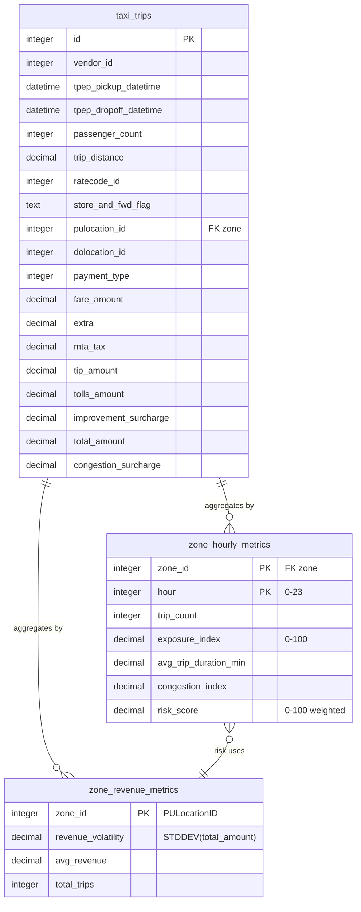

# Entity Relationship Diagram – InsurTech Taxi Risk Model

## Overview

The database supports **trip density**, **hourly exposure**, **congestion intensity**, **revenue volatility**, and a **custom risk score** per zone per hour. All derived metrics are precomputed into `zone_hourly_metrics` for fast API/dashboard use.

---

## Entity Relationship Diagram (Mermaid)

---

## Table Descriptions

| Table | Purpose |
|-------|--------|
| **taxi_trips** | Raw TLC-style trip records. `pulocation_id` = pickup zone (used as zone_id everywhere). |
| **zone_revenue_metrics** | Per-zone revenue stats: volatility (stddev), average revenue, trip count. Used in risk score. |
| **zone_hourly_metrics** | Precomputed per zone per hour: trip count, exposure index, avg duration, congestion index, risk score. |

---

## Data Flow (Logical)

1. **taxi_trips** → Trip density (count per zone per hour).
2. Trip density → **Exposure index** (zone count / max count for that hour, scaled 0–100).
3. **taxi_trips** → Avg trip duration per zone per hour → **Congestion index** (duration × exposure).
4. **taxi_trips** → **zone_revenue_metrics** (volatility and avg revenue per zone).
5. **zone_hourly_metrics** = f(exposure, congestion, revenue_volatility) → **Risk score** (e.g. 0.4×exposure + 0.3×congestion_norm + 0.3×volatility_norm).

---

## Relationships

- **taxi_trips.pulocation_id** → zone identifier used in both `zone_revenue_metrics.zone_id` and `zone_hourly_metrics.zone_id`.
- **zone_hourly_metrics** is built from aggregates of **taxi_trips** and (for risk) from **zone_revenue_metrics**; no direct FK from metrics tables back to taxi_trips, only logical “aggregates by zone/hour”.
